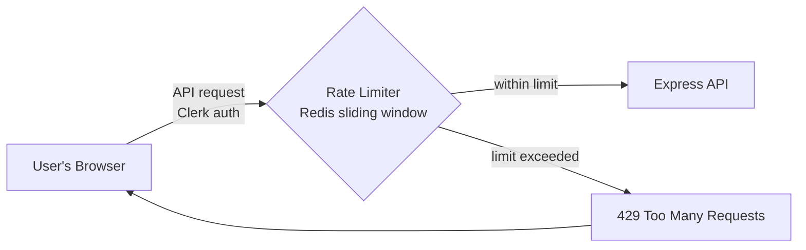
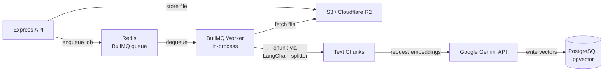
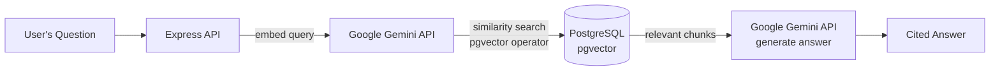

# DocSense

**AI-powered document intelligence — parse, embed, and query unstructured documents through natural conversation.**

DocSense ingests documents, chunks and embeds them into a vector store, and exposes a retrieval-augmented Q&A interface so users can query their own knowledge base conversationally, with every answer traceable back to its source.

---

## Table of Contents

- [Tech Stack](#tech-stack)
- [Architecture](#architecture)
- [Prerequisites](#prerequisites)
- [Setup & Running the Application](#setup--running-the-application)
- [Environment Variables](#environment-variables)
- [Database Migrations](#database-migrations)
- [Architecture Notes](#architecture-notes)
- [Deployment](#deployment)
- [Project Structure](#project-structure)

---

## Tech Stack

| Layer | Technology |
|---|---|
| Backend runtime | Bun (v1.3+) |
| Backend framework | Express |
| ORM | Prisma |
| Document chunking | LangChain (text splitter) |
| Task queue | BullMQ |
| Rate limiting | Redis-backed sliding window algorithm |
| Frontend | React 19, Vite, TypeScript |
| Auth | Clerk |
| Frontend serving | Nginx (local) / Vercel (production) |
| Database | PostgreSQL + `pgvector` |
| Cache, rate limiting & queue broker | Redis 7 (local) / Upstash Redis (production) |
| AI | Google Gemini API (embeddings + chat completion) |
| Object storage | AWS S3 SDK (Cloudflare R2 compatible) |

---

## Architecture

DocSense runs as four services: a static frontend, a single Bun backend process that handles API requests, rate limiting, and background job processing, a Postgres instance with the `pgvector` extension, and Redis acting as a cache, rate-limit counter store, and BullMQ job broker.

### Request & rate limiting flow



Every request is authenticated via Clerk, then checked against a Redis-backed sliding-window counter. Requests within the limit reach the API; requests over the limit are rejected immediately, before touching the database or any paid Gemini API call.

### Document ingestion flow



A user uploads a document, the API stores the file and enqueues a processing job, and the in-process BullMQ worker dequeues the job, fetches the file, splits it into chunks with LangChain's text splitter, requests embeddings from Gemini, and writes the resulting vectors to Postgres.

### Query flow



A user asks a question, the API embeds it via Gemini, runs a cosine-distance similarity search against `pgvector`, retrieves the most relevant chunks, and sends them back to Gemini to generate a grounded, cited answer.


---

## Prerequisites

To run DocSense locally or in production, ensure you have the following installed:

- **Docker** and **Docker Compose**

*(For local non-Docker development only)*
- **Bun v1.3+** — backend
- **Node.js v20+** and **npm** — frontend

---

## Setup & Running the Application

### 1. Clone the repository

```bash
git clone <repository-url>
cd docsense
```

### 2. Configure environment variables

Copy the example file and fill in your own credentials:

```bash
cp .env.example .env
```

You'll need valid keys for **Clerk**, **Google Gemini**, and your **S3-compatible storage** provider. See [Environment Variables](#environment-variables) below for the full list.

### 3. Start the stack

```bash
docker compose up --build
```

This spins up four containers:

| Service | Description |
|---|---|
| `docsense-db` | PostgreSQL with `pgvector` |
| `docsense-redis` | Redis — cache, rate limiting, and BullMQ broker |
| `docsense-backend` | Bun/Express API + in-process BullMQ worker |
| `docsense-frontend` | React SPA served via Nginx |

Exposed ports are configured via environment variables in `.env` / `docker-compose.yaml` and may differ between local development and deployment targets — check those files for the active values in your environment.

---

## Environment Variables

All required variables are documented with placeholders in `.env.example`. At minimum you'll need:

- `DATABASE_URL`, `WORKER_DATABASE_URL` — Postgres connection strings
- `REDIS_URL`, `BULLMQ_REDIS_URL` — Redis connection strings (also used for rate-limit counters)
- `CLERK_PUBLISHABLE_KEY`, `CLERK_SECRET_KEY` — authentication
- `GEMINI_API_KEY`, `GEMINI_EMBEDDING_API_KEY` — AI provider
- `AWS_REGION`, `AWS_ACCESS_KEY_ID`, `AWS_SECRET_ACCESS_KEY`, `AWS_S3_BUCKET_NAME` — object storage
- `VITE_API_URL`, `VITE_CLERK_PUBLISHABLE_KEY` — baked into the frontend bundle at build time

> **Note:** `VITE_*` variables are baked into the static frontend bundle at build time since the app runs entirely in the browser. Secret keys (`CLERK_SECRET_KEY`, AWS credentials) are only ever used server-side and are never exposed to the frontend build.

---

## Database Migrations

On startup, the backend container automatically runs:

```bash
bunx prisma migrate deploy
```

If a migration fails, the container exits immediately (fail-fast) rather than starting the server against an inconsistent schema.

---

## Architecture Notes

- **Single-process worker** — The BullMQ queue worker is started in-process alongside the API server (`startWorker()` in `server.ts`), not as a separate container. This keeps the deployment simple and avoids the cost of running a dedicated worker service.
- **Rate limiting** — Every API request passes through a sliding-window rate limiter backed by Redis before reaching business logic. Requests over the limit are rejected early with a `429`, protecting against abuse and controlling cost on paid Gemini API calls.
- **Chunking** — Documents are split into chunks using LangChain's text splitter before embedding, preserving semantic boundaries better than a naive fixed-length split.
- **Vector search** — Query relevance is computed using `pgvector`'s cosine distance operator (`<=>`) with a similarity threshold, over 768-dimensional Gemini embeddings.
- **Static frontend, browser-driven API calls** — The React SPA is compiled to static assets by Vite and served statically (Nginx locally, Vercel in production). Because the app runs in the user's browser (not inside the Docker network), it calls the backend via `VITE_API_URL` — a publicly reachable URL baked in at build time — not the internal Docker service name.

---

## Deployment

The production deployment differs from the local Docker Compose setup:

| Component | Local (Docker Compose) | Production |
|---|---|---|
| Frontend | Nginx container | Vercel |
| Backend | Docker container | Render (Web Service, Docker) |
| Redis | Local Redis container | Upstash Redis (TCP / `rediss://` connection) |
| Postgres | Local Postgres container | Managed Postgres instance |

Key points:

- The frontend's `VITE_API_URL` must point to the deployed backend's public URL (e.g. `https://your-service.onrender.com/api`), not `localhost`.
- The backend's CORS configuration must explicitly allow the deployed frontend's origin (e.g. the Vercel URL) in addition to local development origins.
- Upstash Redis requires the **TCP connection string** (`rediss://default:<password>@<endpoint>.upstash.io:<port>`) for `ioredis`/BullMQ — not the REST URL/token pair, which only works with the `@upstash/redis` REST client.

---

## Project Structure

```
docsense/
├── backend/           # Bun + Express API, BullMQ worker, Prisma schema
├── frontend/          # React + Vite SPA
├── docker-compose.yaml
├── .env.example
└── README.md
```
