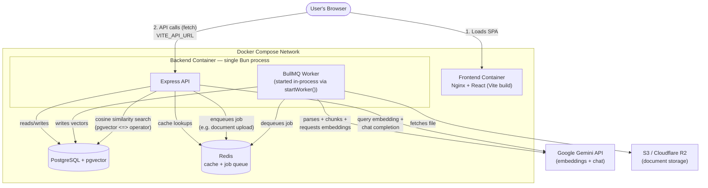

# DocSense

**AI-powered document intelligence — parse, embed, and query unstructured documents through natural conversation.**

DocSense ingests documents, chunks and embeds them into a vector store, and exposes a retrieval-augmented Q&A interface so users can query their own knowledge base conversationally instead of manually searching through files.

---

## Table of Contents

- [Tech Stack](#tech-stack)
- [Architecture](#architecture)
- [Prerequisites](#prerequisites)
- [Setup & Running the Application](#setup--running-the-application)
- [Environment Variables](#environment-variables)
- [Database Migrations](#database-migrations)
- [Architecture Notes](#architecture-notes)
- [Project Structure](#project-structure)

---

## Tech Stack

| Layer | Technology |
|---|---|
| Backend runtime | Bun (v1.3+) |
| Backend framework | Express |
| ORM | Prisma |
| Task queue | BullMQ |
| Frontend | React 19, Vite, TypeScript |
| Auth | Clerk |
| Production frontend serving | Nginx |
| Database | PostgreSQL + `pgvector` |
| Cache & queue broker | Redis 7 |
| AI | Google Gemini API (embeddings + chat completion) |
| Object storage | AWS S3 SDK (Cloudflare R2 compatible) |

---

## Architecture

DocSense runs as four containers: a static frontend served by Nginx, a single Bun backend process that handles both API requests and background job processing, a Postgres instance with the `pgvector` extension, and Redis acting as both a cache and the BullMQ job broker.



**Document ingestion flow:** a user uploads a document → the API stores the file in S3/R2 and enqueues a processing job in Redis → the in-process BullMQ worker picks up the job, parses and chunks the document, requests embeddings from Gemini, and writes the resulting vectors to Postgres.

**Query flow:** a user asks a question → the API embeds the query via Gemini, runs a cosine-distance similarity search against `pgvector`, retrieves the relevant chunks, and sends them to Gemini for answer generation.

---

## Prerequisites

To run DocSense locally or in production, ensure you have the following installed:

- **Docker** and **Docker Compose**

*(For local non-Docker development only)*
- **Bun v1.3+** — backend
- **Node.js v20+** and **npm** — frontend

---

## Setup & Running the Application

### 1. Clone the repository

```bash
git clone <repository-url>
cd docsense
```

### 2. Configure environment variables

Copy the example file and fill in your own credentials:

```bash
cp .env.example .env
```

You'll need valid keys for **Clerk**, **Google Gemini**, and your **S3-compatible storage** provider. See [Environment Variables](#environment-variables) below for the full list.

### 3. Start the stack

```bash
docker compose up --build
```

This spins up four containers:

| Service | Description |
|---|---|
| `docsense-db` | PostgreSQL with `pgvector` |
| `docsense-redis` | Redis (cache + BullMQ broker) |
| `docsense-backend` | Bun/Express API + in-process BullMQ worker |
| `docsense-frontend` | React SPA served via Nginx |

Exposed ports are configured via environment variables in `.env` / `docker-compose.yaml` and may differ between local development and deployment targets — check those files for the active values in your environment.

---

## Environment Variables

All required variables are documented with placeholders in `.env.example`. At minimum you'll need:

- `DATABASE_URL`, `WORKER_DATABASE_URL` — Postgres connection strings
- `REDIS_URL`, `BULLMQ_REDIS_URL` — Redis connection strings
- `CLERK_PUBLISHABLE_KEY`, `CLERK_SECRET_KEY` — authentication
- `GEMINI_API_KEY`, `GEMINI_EMBEDDING_API_KEY` — AI provider
- `AWS_REGION`, `AWS_ACCESS_KEY_ID`, `AWS_SECRET_ACCESS_KEY`, `AWS_S3_BUCKET_NAME` — object storage
- `VITE_API_URL`, `VITE_CLERK_PUBLISHABLE_KEY` — baked into the frontend bundle at build time

> **Note:** `VITE_*` variables are baked into the static frontend bundle at Docker build time since the app runs entirely in the browser. Secret keys (`CLERK_SECRET_KEY`, AWS credentials) are only ever used server-side and are never exposed to the frontend build.

---

## Database Migrations

On startup, the backend container automatically runs:

```bash
bunx prisma migrate deploy
```

If a migration fails, the container exits immediately (fail-fast) rather than starting the server against an inconsistent schema.

---

## Architecture Notes

- **Single-process worker** — The BullMQ queue worker is started in-process alongside the API server (`startWorker()` in `server.ts`), not as a separate container. This keeps the deployment simple and avoids the cost of running a dedicated worker service.
- **Static frontend, browser-driven API calls** — The React SPA is compiled to static assets by Vite and served by Nginx. Because the app runs in the user's browser (not inside the Docker network), it calls the backend via `VITE_API_URL` — a publicly reachable URL baked in at build time — not the internal Docker service name.
- **Vector search** — Query relevance is computed using `pgvector`'s cosine distance operator (`<=>`) with a similarity threshold, over 768-dimensional Gemini embeddings.

---

## Project Structure

```
docsense/
├── backend/          # Bun + Express API, BullMQ worker, Prisma schema
├── frontend/          # React + Vite SPA
├── docker-compose.yaml
├── .env.example
└── README.md
```