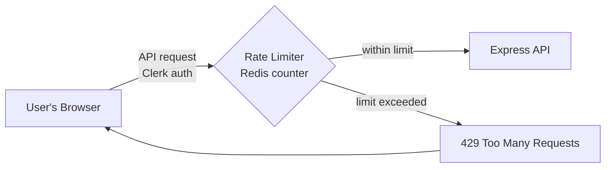
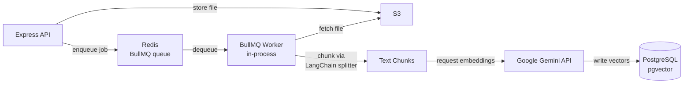
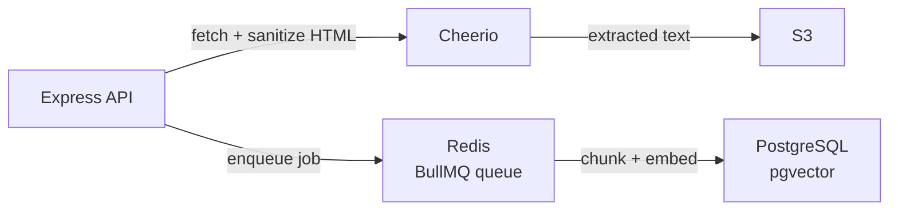
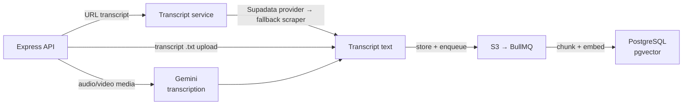
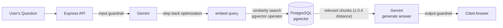

# DocSense

**AI-powered document intelligence — parse, embed, and query unstructured documents through natural conversation.**

DocSense ingests documents from three source types — **PDF files**, **web pages (URLs)**, and **YouTube videos/transcripts/media** — chunks and embeds them into a vector store, and exposes a retrieval-augmented Q&A interface so users can query their own knowledge base conversationally, with every answer traceable back to its source.

Every question is checked by an input guardrail, optimized for retrieval (step-back prompting), embedded and run through a `pgvector` similarity search, and answered only from the retrieved chunks. The generated answer is then passed through an output guardrail before being returned to the user.

---

## Table of Contents

- [Tech Stack](#tech-stack)
- [Architecture](#architecture)
- [Prerequisites](#prerequisites)
- [Setup & Running the Application](#setup--running-the-application)
- [Environment Variables](#environment-variables)
- [Database Migrations](#database-migrations)
- [Architecture Notes](#architecture-notes)
- [Deployment](#deployment)
- [Project Structure](#project-structure)

---

## Tech Stack

| Layer | Technology |
|---|---|
| Backend runtime | Bun (v1.3+) |
| Backend framework | Express |
| ORM | Prisma (with `@prisma/adapter-pg`) |
| Document chunking | LangChain (`RecursiveCharacterTextSplitter`) |
| Task queue | BullMQ |
| Rate limiting | Redis-backed counter (fixed window, 20 req/min) |
| Frontend | React 19, Vite, TypeScript, Tailwind CSS |
| Auth | Clerk |
| Frontend serving | Nginx |
| Database | PostgreSQL + `pgvector` |
| Cache, rate limiting & queue broker | Redis (local) / Upstash (production) |
| AI | Google Gemini (embeddings, query optimization, guardrails, chat) |
| Object storage | AWS S3 SDK |
| Web scraping | Cheerio |
| YouTube transcripts | `youtube-transcript-plus` + Supadata API (provider) |

---

## Architecture

DocSense runs as four services: a static frontend, a single Bun backend process that handles API requests, rate limiting, and background job processing, a Postgres instance with the `pgvector` extension, and Redis acting as a cache, rate-limit counter store, and BullMQ job broker.

### Request & rate limiting flow


```mermaid
flowchart LR
    A["User's Browser"] -->|"API request<br/>Clerk auth"| B{"Rate Limiter<br/>Redis counter"}
    B -->|"within limit"| C["Express API"]
    B -->|"limit exceeded"| D["429 Too Many Requests"]
    D --> A
```

Every request is authenticated via Clerk, then checked against a Redis-backed counter keyed by method + path + user/IP and reset every 60 seconds (max 20 requests). Requests within the limit reach the API; requests over the limit are rejected immediately, before touching the database or any paid Gemini API call.

### Document ingestion flow (PDF)


```mermaid
flowchart LR
    A["Express API"] -->|"store file"| B["S3"]
    A -->|"enqueue job"| C["Redis<br/>BullMQ queue"]
    C -->|"dequeue"| D["BullMQ Worker<br/>in-process"]
    D -->|"fetch file"| B
    D -->|"chunk via<br/>LangChain splitter"| E["Text Chunks"]
    E -->|"request embeddings"| F["Google Gemini API"]
    F -->|"write vectors"| G[("PostgreSQL<br/>pgvector")]
```

A user uploads a PDF, the API stores the file and enqueues a processing job, and the in-process BullMQ worker dequeues the job, fetches the file, parses the PDF (max 100 pages), splits it into chunks with LangChain's text splitter, requests embeddings from Gemini, and writes the resulting 768-dimension vectors to Postgres.

### Web URL ingestion flow


```mermaid
flowchart LR
    A["Express API"] -->|"fetch + sanitize HTML"| B["Cheerio"]
    B -->|"extracted text"| C["S3"]
    A -->|"enqueue job"| D["Redis<br/>BullMQ queue"]
    D -->|"chunk + embed"| E["PostgreSQL<br/>pgvector"]
```

A user submits an HTTPS web URL. The URL is validated for public DNS resolution (SSRF protection), fetched with redirect / size / timeout caps, and its readable text is extracted with Cheerio. The text is stored to S3 and queued through the same chunk → embed → index pipeline as PDFs, tagged as `sourceType = WEBSITE`.

### YouTube ingestion flow


```mermaid
flowchart LR
    A["Express API"] -->|"URL transcript"| B["Transcript service"]
    B -->|"Supadata provider → fallback scraper"| C["Transcript text"]
    A -->|"transcript .txt upload"| C
    A -->|"audio/video media"| D["Gemini<br/>transcription"]
    D --> C
    C -->|"store + enqueue"| E["S3 → BullMQ"]
    E -->|"chunk + embed"| F["PostgreSQL<br/>pgvector"]
```

A user ingests a YouTube source in one of three ways, all producing a `sourceType = YOUTUBE` document that flows through the standard chunk → embed → index pipeline:

1. **Video URL** — the transcript is fetched (Supadata provider first if `SUPADATA_API_KEY` is set, otherwise the `youtube-transcript-plus` scraper), cached in Redis for 24h, and stored to S3 along with title/channel/videoId metadata.
2. **Transcript file upload** — a plain-text `.txt` transcript (max 2MB) is stored to S3.
3. **Audio/video media upload** — the media (magic-byte validated) is sent to the Gemini Files API for transcription, then stored to S3.

### Query flow


```mermaid
flowchart LR
    A["User's Question"] --> B["Express API"]
    B -->|"input guardrail"| C["Gemini"]
    C -->|"step-back optimization"| D["embed query"]
    D -->|"similarity search<br/>pgvector operator"| E[("PostgreSQL<br/>pgvector")]
    E -->|"relevant chunks (≤ 0.4 distance)"| F["Gemini<br/>generate answer"]
    F -->|"output guardrail"| G["Cited Answer"]
```

A user asks a question; the input is scanned by a Gemini guardrail for injection/jailbreak attempts, rewritten into a broader step-back query that improves retrieval, embedded via Gemini, and matched with a cosine-distance (`<=>`) search over `pgvector`. The most relevant chunks (within a distance threshold) are sent back to Gemini to generate a grounded, cited answer, which is then scanned by an output guardrail before it is returned.

---

## Prerequisites

To run DocSense locally or in production, ensure you have the following installed:

- **Docker** and **Docker Compose**

*(For local non-Docker development only)*
- **Bun v1.3+** — backend
- **Node.js v20+** and **npm** — frontend

---

## Setup & Running the Application

### 1. Clone the repository

```bash
git clone <repository-url>
cd docsense
```

### 2. Configure environment variables

Copy the example file and fill in your own credentials:

```bash
cp .env.example .env
```

You'll need valid keys for **Clerk**, **Google Gemini** (four keys — see [Environment Variables](#environment-variables)), and your **S3-compatible storage** provider. See [Environment Variables](#environment-variables) below for the full list.

### 3. Start the stack

```bash
docker compose up --build
```

This spins up four containers:

| Service | Description |
|---|---|
| `docsense-db` | PostgreSQL with `pgvector` |
| `docsense-redis` | Redis — cache, rate limiting, and BullMQ broker |
| `docsense-backend` | Bun/Express API + in-process BullMQ worker |
| `docsense-frontend` | React SPA served via Nginx |

Exposed ports are configured via environment variables in `.env` / `docker-compose.yaml` and may differ between local development and deployment targets — check those files for the active values in your environment.

---

## Environment Variables

All required variables are documented with placeholders in `.env.example`. At minimum you'll need:

- `DATABASE_URL`, `WORKER_DATABASE_URL` — Postgres connection strings (app and worker clients)
- `REDIS_URL`, `BULLMQ_REDIS_URL` — Redis connection strings (cache / rate-limit counters and BullMQ broker)
- `CLERK_SECRET_KEY` — server-side authentication (`@clerk/express`)
- `GEMINI_API_KEY`, `GEMINI_EMBEDDING_API_KEY`, `GEMINI_QUERY_API_KEY`, `GEMINI_GUARD_API_KEY` — AI provider (separate key per pipeline stage)
- `AWS_REGION`, `AWS_ACCESS_KEY_ID`, `AWS_SECRET_ACCESS_KEY`, `AWS_S3_BUCKET_NAME` — object storage
- `VITE_API_URL`, `VITE_CLERK_PUBLISHABLE_KEY` — baked into the frontend bundle at build time

Additional, optional or environment-specific variables used by the code:

- `FRONTEND_URL` — comma-separated list of allowed CORS origins
- `PORT` — backend listen port (default `5000`)
- `NODE_ENV` — runtime environment
- `SUPADATA_API_KEY` — optional third-party YouTube transcript provider (when set, used before the built-in scraper)
- `GEMINI_TRANSCRIPTION_MODEL` — optional override for the Gemini media-transcription model
- `REDIS_HOST`, `REDIS_PORT` — fallback local Redis connection for non-Docker development

> **Note:** `VITE_*` variables are baked into the static frontend bundle at build time since the app runs entirely in the browser. Secret keys (`CLERK_SECRET_KEY`, AWS credentials, Gemini keys) are only ever used server-side and are never exposed to the frontend build.

---

## Database Migrations

On startup, the backend container automatically runs:

```bash
bunx prisma migrate deploy
```

If a migration fails, the container exits immediately (fail-fast) rather than starting the server against an inconsistent schema.

---

## Architecture Notes

- **Single-process worker** — The BullMQ queue worker is started in-process alongside the API server (`startWorker()` in `server.ts`), not as a separate container. This keeps the deployment simple and avoids the cost of running a dedicated worker service.
- **Rate limiting** — Every API request passes through a Redis-backed counter (`INCR` + 60s expiry, max 20) before reaching business logic. Requests over the limit are rejected early with a `429`, protecting against abuse and controlling cost on paid Gemini API calls.
- **Four Gemini clients** — The AI provider initializes separate clients with dedicated keys for Q&A, query optimization, guardrails, and embeddings (`config/ai/ai.ts`).
- **Guardrails** — Both input (prompt injection / jailbreak / system-prompt extraction / instruction override / role manipulation) and output (prompt leakage / chain-of-thought / sensitive info / PII / harmful content) are classified by Gemini before and after generation.
- **Chunking** — Documents are split into chunks using LangChain's recursive character text splitter (chunk size 1000, overlap 200) before embedding, preserving semantic boundaries better than a naive fixed-length split.
- **Vector search** — Query relevance is computed using `pgvector`'s cosine distance operator (`<=>`), filtered by a distance threshold, over 768-dimensional Gemini embeddings, scoped to the signed-in user and (optionally) a single document.
- **Static frontend, browser-driven API calls** — The React SPA is compiled to static assets by Vite and served statically by Nginx. Because the app runs in the user's browser (not inside the Docker network), it calls the backend via `VITE_API_URL` — a publicly reachable URL baked in at build time — not the internal Docker service name.

---

## Deployment

The production deployment differs from the local Docker Compose setup:

| Component | Local (Docker Compose) | Production |
|---|---|---|
| Frontend | Nginx container | Externally hosted static SPA |
| Backend | Docker container | Hosted container service (Docker) |
| Redis | Local Redis container | Upstash Redis (TCP / `rediss://` connection) |
| Postgres | Local Postgres container | Managed Postgres instance |

Key points:

- The frontend's `VITE_API_URL` must point to the deployed backend's public URL, not `localhost`.
- The backend's CORS configuration (`FRONTEND_URL`) must explicitly allow the deployed frontend's origin in addition to local development origins.
- Upstash Redis requires the **TCP connection string** (`rediss://default:<password>@<endpoint>.upstash.io:<port>`) for `ioredis`/BullMQ — not the REST URL/token pair, which only works with the `@upstash/redis` REST client.

---

## Project Structure

```
docsense/
├── backend/           # Bun + Express API, BullMQ worker, Prisma schema
├── frontend/          # React + Vite SPA
├── docker-compose.yaml
├── .env.example
└── README.md
```
